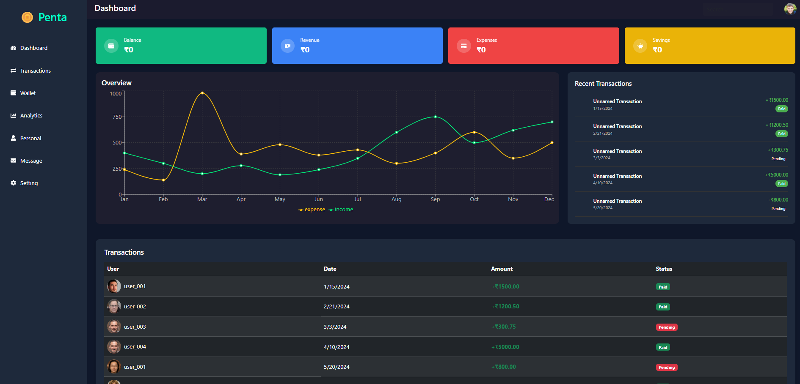

# 💰 Finance Dashboard

A modern financial dashboard web application that helps you visualize, track, and manage your income, expenses, and savings with clarity.

## 🚀 Features

- 🧾 **Transactions Management**: Add, edit, delete financial transactions.
- 📊 **Overview Dashboard**: Summary cards for Balance, Revenue, Expenses, and Savings.
- 📈 **Charts**: Monthly income vs expenses visualized.
- 📋 **Recent Transactions**: Quick view of the latest activity.
- 📥 **CSV Export**: Download all your transactions in CSV format.
- 🧠 **Django Backend**: RESTful API using Django REST Framework.
- ⚛️ **React Frontend**: Responsive UI built with React and Bootstrap.
- 🔐 **Authentication**: Secured endpoints using token-based authentication.

## 🛠️ Tech Stack

### Backend:
- Python
- Django + Django REST Framework
- Django Filters
- SQLite (or replace with PostgreSQL)

### Frontend:
- React
- Axios
- Bootstrap
- React Router
- Recharts

## 📁 Project Structure

```
financial-dashboard/
├── backend/
│   ├── manage.py
│   ├── transactions/
│   └── ...
├── frontend/
│   ├── src/
│   ├── public/
│   └── ...
├── .gitignore
├── README.md
```

## 🧑‍💻 Getting Started

### 1. Clone the Repository
```bash
git clone https://github.com/Akhil70722/Finance-Dashboard.git
cd Finance-Dashboard
```

---

### 2. Backend Setup (Django)

```bash
cd backend
python -m venv venv
venv\Scripts\activate  # On Windows
pip install -r requirements.txt
python manage.py migrate
python manage.py runserver
```

---

### 3. Frontend Setup (React)

```bash
cd frontend
npm install
npm start
```

---

## 🔐 Authentication

To access protected routes (like `/api/transactions/`), include your token in headers:
```
Authorization: Token your_token_here
```

---

## 📦 .env Example (Frontend)

```env
REACT_APP_API_URL=http://localhost:8000/api
```

---

## 📤 Deployment

For production deployment:
- Use PostgreSQL for DB
- Deploy backend on Render/Heroku
- Deploy frontend on Vercel/Netlify
- Use `.env` for secrets

---

## 📸 Screenshots



---
